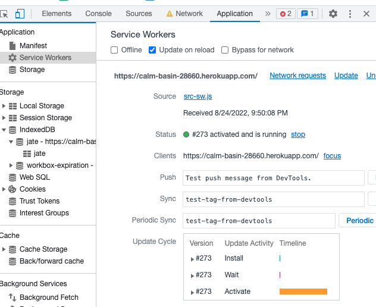

# Progressive Web Applications (PWA): Text Editor

  ## Description

  This is a single-page application with methods for getting and storing data to an IndexedDB database. The application will also function offline.

  [Live Link](https://calm-basin-28660.herokuapp.com/)

  ## Screenshots:
  

  ## Table of Contents
  #### [Contribution](#contribution)
  #### [License](#license)
  #### [Contact](#questions)

  ## Contribution

  - Submit a pull request

  ## License

  

  
  